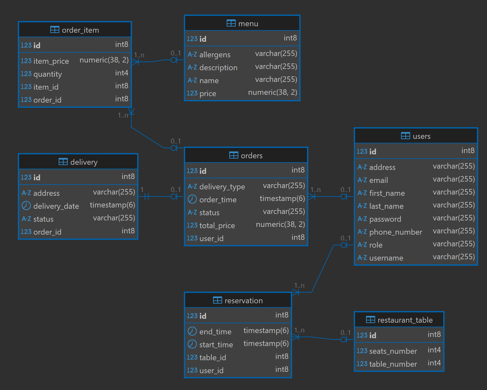

# RestaurantMS

**Autor**
Arkadiusz Domżał, grupa lab 1

**RestaurantMS** to aplikacja restauracyjna zbudowana w technologii **Java 21**, **Spring Boot**, **PostgreSQL** i **Docker**, umożliwiająca zarządzanie:
- użytkownikami,
- rezerwacjami stolików,
- zamówieniami (na miejscu / z dostawą),
- menu i pozycjami w zamówieniu,
- dostawami powiązanymi z zamówieniami.

---

## Technologie

- Java 21 + Spring Boot 3
- PostgreSQL 15 (Docker)
- Spring Data JPA
- Spring Web (REST API)
- Docker & Docker Compose
- Maven
- Swager API

---

## Diagram ERD bazy danych



## 🛠️ Uruchamianie z Docker Compose

Poniżej znajdują się pełne komendy do zbudowania i uruchomienia aplikacji od zera:

```bash
# 1. Zatrzymaj i usuń stare kontenery oraz dane bazy
docker-compose down -v

# 2. Zbuduj aplikację Spring Boot (pomija testy)
mvn clean package -DskipTests

# 3. Uruchom ponownie kontenery z nową wersją aplikacji
docker-compose up --build

```

##  Swagger API

Dostęp do dokumentacji API znajduje się pod adresem:

➡️ [http://localhost:8080/swagger-ui/index.html#/](http://localhost:8080/swagger-ui/index.html#/)

Endpointy:


## Testowanie aplikacji

Wykonano testy jednostkowe i integracyjne:


Stan pokrycia:
Klasy: 94% (17 z 18 klas pokrytych testami)
Metody: 98% (83 z 84 metod przetestowanych)
Linie kodu: 99% (266 z 268 linii przetestowanych)
Rozgałęzienia (Branch): 82% (68 z 82 warunków logicznych przetestowanych)


[Repozytorium na GitHubie](https://github.com/Arek321/Project-Restaurant)


